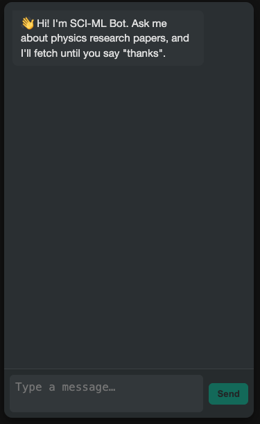
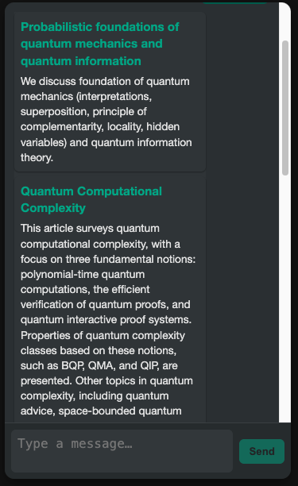
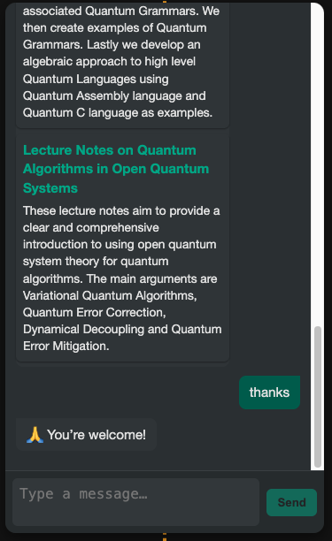

# 🤖 SCIML AI Bot – Semantic Search + Chat UI (Microservices)

An AI-powered microservice-based app that lets users **chat naturally** and **search academic papers** from [arXiv.org](https://arxiv.org) using **semantic similarity and embeddings**.

---

## 💡 What This Does

This project allows users to:

- 🔍 Search for relevant academic papers by **topic or question**, not just keywords.
- 💬 Use a **chat-style UI** to interact with an AI assistant.
- 🤖 Retrieve titles, abstracts, authors, and direct links to papers using a semantic model.
- 📦 Works across **two microservices**: a FastAPI-based ML backend and a frontend chat interface.

---

## ⚙️ Microservice Architecture
[ User Chat UI ] <--> [ FastAPI API Microservice ] <--> [ arXiv + Embedding Model ]


### 🧩 Microservices Breakdown:

#### 1️⃣ **Frontend (Chat UI)**
- WhatsApp-style UI
- Sends user queries to backend
- Displays matching paper results like chat replies

#### 2️⃣ **Backend (FastAPI API)**
- Fetches papers from arXiv based on the query
- Generates embeddings for papers and query
- Computes cosine similarity and returns top matches

---

## 📸 Demo Screenshots

### 🔍 1. Chat Interface (WhatsApp-style)


### 📊 2. Search research papers


### 📄 3. Goodbye



---

## 🚀 Demo Flow (How It Works)

1. You ask something like:  
   `"Show me recent papers on black hole thermodynamics"`

2. The backend:
   - Fetches arXiv papers
   - Generates embeddings for each paper's title + abstract
   - Compares with your query using **cosine similarity**

3. Returns top matching results like:
```json
[
  {
    "title": "Black Hole Thermodynamics and Quantum Gravity",
    "abstract": "We study the thermodynamic behavior of black holes...",
    "score": 0.92,
    "link": "https://arxiv.org/abs/2305.12345"
  }
]
4. The chat UI displays these results in a human-friendly way.


| Method | Endpoint   | Description                          |
| ------ | ---------- | ------------------------------------ |
| POST   | `/embed/`  | Embed and store new arXiv papers     |
| GET    | `/papers/` | List stored papers from the database |
| GET    | `/search/` | Search for papers by semantic query  |
| GET    | `/docs`    | OpenAPI/Swagger UI                   |


| Layer    | Tech                  |
| -------- | --------------------- |
| Frontend | \[React/Vue/etc.]     |
| Backend  | FastAPI, SQLAlchemy   |
| ML Model | Sentence Transformers |
| Data     | arXiv API             |
| DB       | SQLite / PostgreSQL   |

